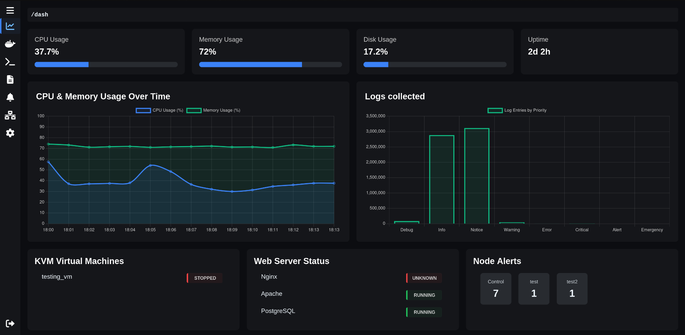
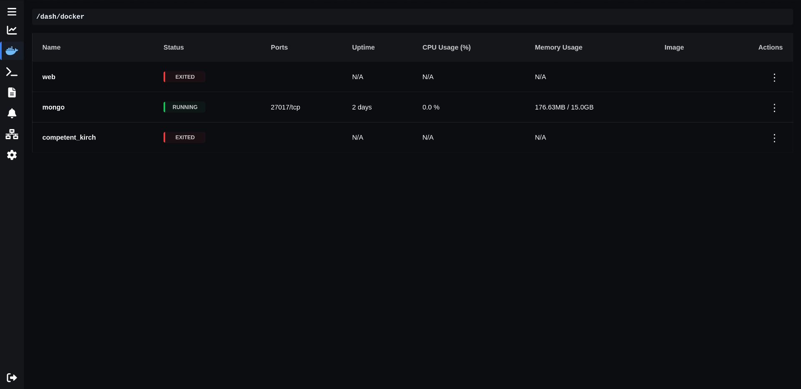
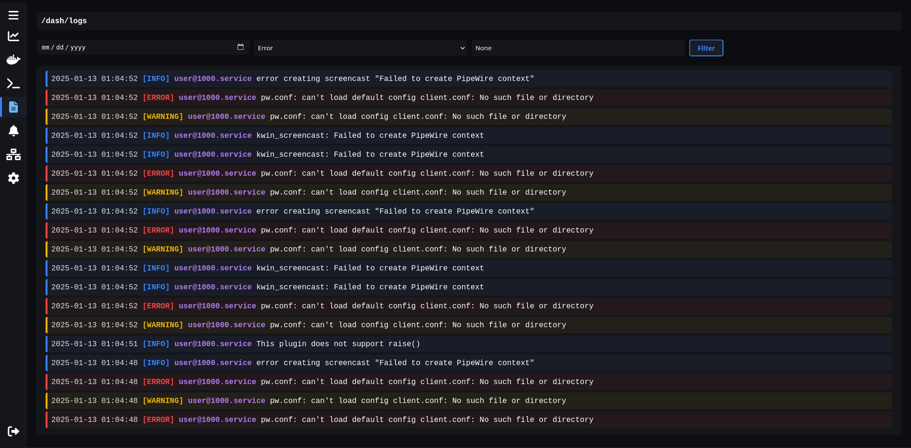
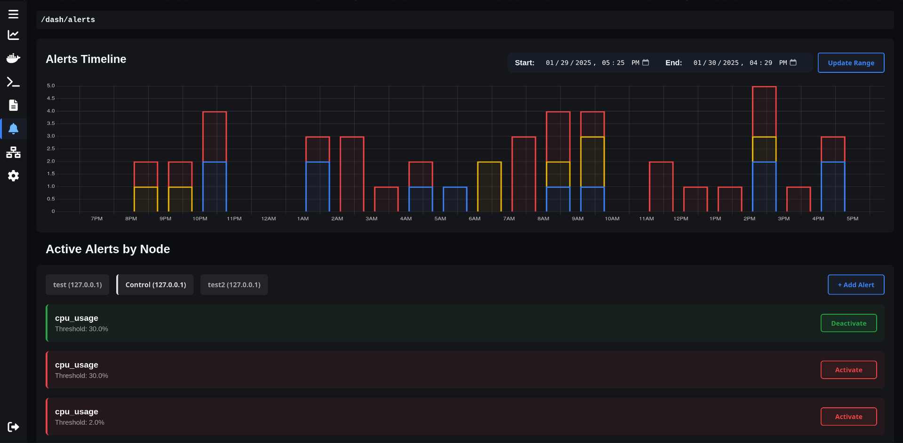
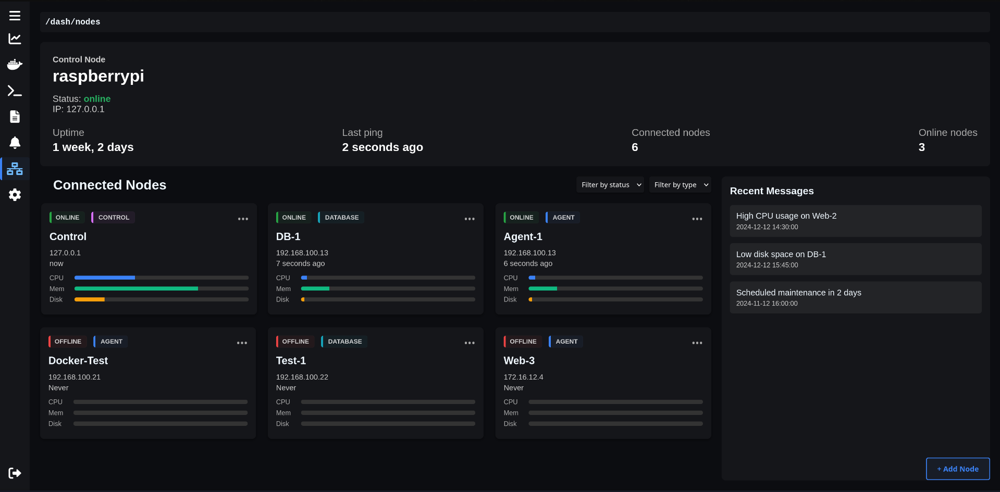
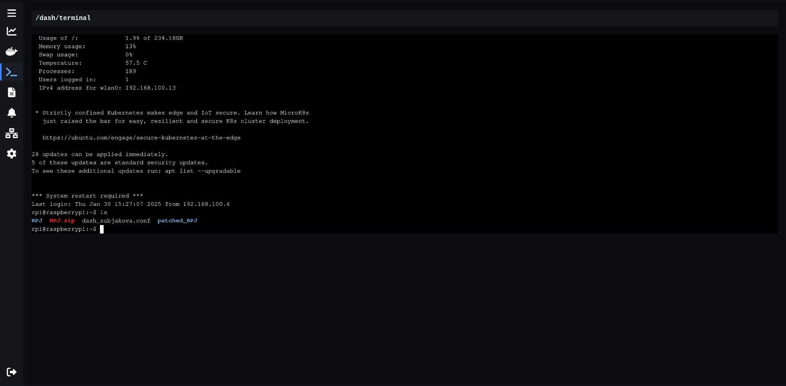
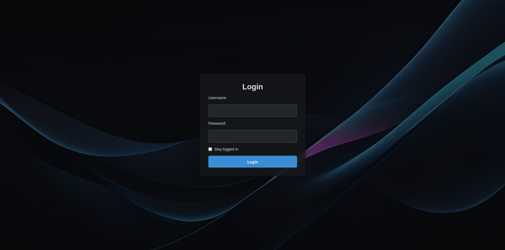

# Slash Dash

**Slash Dash** is a real-time server monitoring dashboard built with Django, Channels, Celery, Redis, and Docker. It provides a unified web UI for:

- 📊 **Analytics**: Live CPU, memory, disk usage graphs  
- 🐳 **Docker Monitoring**: List, start, stop, and restart containers  
- 📜 **System Logs**: Filter by date, priority, or text search  
- 💻 **Web Terminal**: Browser-based shell for admins  
- 🛠️ **Service Status**: KVM VMs, Nginx, Apache, and PostgreSQL health checks

---

## 📂 Table of Contents

- [Features](#features)  
- [Tech Stack](#tech-stack)  
- [Getting Started](#getting-started)  
  - [Prerequisites](#prerequisites)  
  - [Installation](#installation)  
  - [Configuration](#configuration)  
- [Screenshots](#screenshots)  


---

## 🚀 Features

- **Real-time Charts** (WebSockets + Chart.js)
- **Container Management** (start/stop/restart Docker containers)
- **Live System Logs** with filters
- **Built-in Terminal** for superusers
- **Status Overview** for KVM, Apache, Nginx, and Postgres

---

## 🛠️ Tech Stack

- **Backend**: Django 5, Channels, DRF  
- **Frontend**: Chart.js, custom HTML/CSS, vanilla JS  
- **Database**: PostgreSQL  
- **Async Tasks**: Celery + Redis + django-celery-beat  
- **WebSocket Server**: Daphne  
- **Container Control**: Docker SDK for Python  
- **Monitoring**: psutil, libvirt, subprocess, systemctl

---

## ⚙️ Getting Started

### Prerequisites

- Python 3.10+  
- PostgreSQL  
- Redis  
- Docker  

### Installation

```bash
# Clone the repo
git clone https://github.com/yourusername/slash-dash.git
cd slash-dash

# Create and activate virtual environment
python3 -m venv venv
source venv/bin/activate

# Install dependencies
pip install -r requirements.txt
```

### Configuration

Create a `.env` file and add your environment variables:

```env
DJANGO_SECRET_KEY=your_secret_key
POSTGRES_DB=rpj
POSTGRES_USER=admin
POSTGRES_PASSWORD=admin
REDIS_URL=redis://localhost:6379/0
```

Run Migrations and Create Superuser

```bash
python manage.py migrate
python manage.py createsuperuser
```

## Screenshots

A quick preview of Slash Dash in action:

### 📊 Main Dashboard  


### 🐳 Docker Monitor  


### 📄 Log Viewer  


### ⚠️ Alert Section  


### 🧮 Node Overview  


### 💻 Web Terminal  


### 🔐 Login Page  


